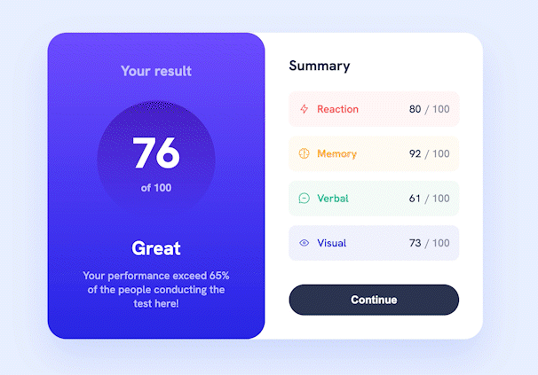

# Results summary component solution

This is a solution to the [Results summary component challenge on Frontend Mentor](https://www.frontendmentor.io/challenges/results-summary-component-CE_K6s0maV).

## Table of contents

- [Overview](#overview)
  - [The challenge](#the-challenge)
  - [Screenshot](#screenshot)
  - [Links](#links)
- [My process](#my-process)
  - [Built with](#built-with)
  - [What I learned](#what-i-learned)
  - [Continued development](#continued-development)
  - [Useful resources](#useful-resources)
- [Author](#author)


## Overview

### The challenge

Users should be able to:

- View the optimal layout for the interface depending on their device's screen size
- See hover and focus states for all interactive elements on the page

### Screenshot



### Links

- [Solution on frontendmentor.io](https://www.frontendmentor.io/solutions/results-summary-component-3CZbIrOGcr)
- [Live preview](https://piwkoo.github.io/results-summary-component/)

## My process

In this project I wanted to start with desktop-first approach which is something I usually don't do because I wanted to check how I'll manage to resolve issues followed by this workflow as well as making everything accessible for smartphone users.

### Built with

- Semantic HTML5 markup
- CSS custom properties
- Flexbox
- Desktop-first workflow
- BEM methodology
- CSS animations

### What I learned

I learned about variable fonts. How they are build, work, and how to use them in project. It was completely new concept for me, so I'm glad something like this came up.

Also, I learned how to create counter using just pure CSS. It's definitely a very neat solution, which doesn't require adding JavaScript code to the project.

Below is piece of code that is responsible for implementing animation:

```css
.result__score::after {
  content: counter(count);
  animation: score-loader .5s both;
  counter-reset: count 0;
}
```

### Continued development

In future projects I would like to focus on pure CSS animations and CSS abilities because it has a lot to offer without Javascript.

### Useful resources

- [Animating Number Counters](https://css-tricks.com/animating-number-counters/) - this helped me with score counter using pure css.
- [Variable fonts](https://web.dev/variable-fonts/) - this article explained me thoroughly variable fonts. 

## Author

- Github - [@PiwkoO](https://github.com/PiwkoO)
- Frontend Mentor - [@PiwkoO](https://www.frontendmentor.io/profile/PiwkoO)
